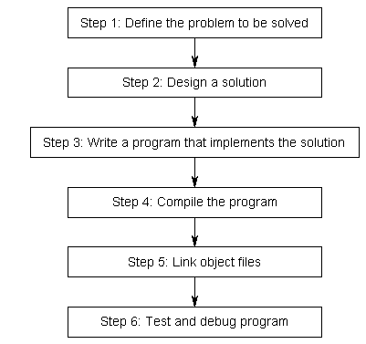
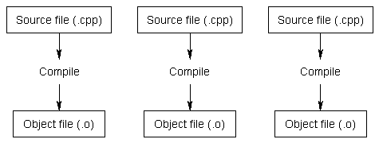

# 0.4 - Introduction to development

BBefore we can write and execute our first program, we need to understand in more detail how C++ programs get developed. Here is a graphic outlining a simplistic approach:




## Step 1: Define the problem that you would like to solve.

This is the “what” step, where you figure out what you are going to solve. Coming up with the initial idea for what you would like to program can be the easiest step, or the hardest. But conceptually, it is the simplest. All you need is an idea that can be well defined, and you’re ready for the next step.

Here are a few examples:

- “I want to write a program that will allow me to enter numbers, then calculates the average.”
- “I want to write a program that generates a 2d maze and lets the user navigate through it.”
- “I want to write a program that reads in a file of stock prices and predicts whether the stock will go up or down.”


## Step 2: Determine how you are going to solve the problem.

This is the “how” step, where you determine how you are going to solve the problem you came up with in step 1. It is also the step that is most neglected in software development. The crux of the issue is that there are many ways to solve a problem -- however, some of these solutions are good and some of them are bad. Too often, a programmer will get an idea, sit down, and immediately start coding a solution. This often generates a solution that falls into the bad category.

Typically, good solutions have the following characteristics:

- They are straightforward.
- They are well documented (especially any assumptions being made).
- They are built modularly, so parts can be reused or changed later without impacting other parts of the program.
- They are robust, and can recover or give useful error messages when something unexpected happens.
When you sit down and start coding right away, you’re typically thinking “I want to do _this_”, so you implement the solution that gets you there the fastest. This can lead to programs that are fragile, hard to change or extend, or have lots of bugs.

Studies have shown that only 20% of a programmer’s time is actually spent writing the initial program. The other 80% is spent debugging (fixing errors) or maintaining (adding features to) a program. Consequently, it’s worth your time to spend a little extra time up front before you start coding thinking about the best way to tackle a problem, what assumptions you are making, and how you might plan for the future, in order to save yourself a lot of time and trouble down the road.

We’ll talk more about how to effectively design solutions to problems in a future lesson.

## Step 3: Write the program

In order to the write the program, we need two things: First we need knowledge of a programming language -- that’s what these tutorials are for! Second, we need an editor. It’s possible to write a program using any editor you want, even something as simple as Window’s notepad or Unix’s vi or pico. However, we strongly urge you to use an editor that is designed for coding. Don’t worry if you don’t have one yet. We’ll cover how to install one soon.

A typical editor designed for coding has a few features that make programming much easier, including:

1) Line numbering. Line numbering is useful when the compiler gives us an error. A typical compiler error will state “error, line 64”. Without an editor that shows line numbers, finding line 64 can be a real hassle.

2) Syntax highlighting and coloring. Syntax highlighting and coloring changes the color of various parts of your program to make it easier to see the overall structure of your program.

3) An unambiguous font. Non-programming fonts often make it hard to distinguish between the number 0 and the letter O, or between the number 1, the letter l (lower case L), and the letter I (upper case i). A good programming font will differentiate these symbols in order to ensure one isn’t accidentally used in place of the other.

Your C++ programs should be called name.cpp, where name is replaced with the name of your program. The .cpp extension tells the compiler (and you) that this is a C++ source code file that contains C++ instructions. Note that some people use the extension .cc instead of .cpp, but we recommend you use .cpp.

Also note that many complex C++ programs have multiple .cpp files. Although most of the programs you will be creating initially will only have a single .cpp file, it is possible to write single programs that have tens if not hundreds of individual .cpp files.

## Step 4: Compiling

In order to compile a program, we need a program called a compiler. The job of the compiler is twofold:

1) To check your program and make sure it follows the rules of the C++ language. If it does not, the compiler will give you an error to help pinpoint what needs fixing.

2) To convert each file of source code into a machine language file called an object file. Object files are typically named name.o or name.obj, where name is the same name as the .cpp file it was produced from. If your program had 5 .cpp files, the compiler would generate 5 object files.



For illustrative purposes only, most Linux and Mac OS X systems come with a C++ compiler called g++. To use g++ to compile a file from the command line, we would do this:

```
g++ -c file1.cpp file2.cpp file3.cpp
```

This would create file1.o, file2.o, and file3.o. The -c means “compile only”, which tells g++ to just produce .o (object) files.

Other compilers are available for Linux, Windows, and just about every other system. We will discuss installing a compiler in the next section, so there is no need to do so now.

For complex projects, some development environments use a makefile, which is a file that tells the compiler which files to compile. Makefiles are an advanced topic, and entire books have been written about them. Fortunately, you don’t need to worry about them, so we will not discuss them here.

## Step 5: Linking

Linking is the process of taking all the object files generated by the compiler and combining them into a single executable program that you can run. This is done by a program called the linker.


In addition to the object files for a program, the linker also includes files from the C++ standard library (or any other precompiled libraries you’re using, such as graphics or sound libraries). The C++ language itself is fairly small and simple. However, it comes with a large library of optional components that may be utilized by your programs, and these components live in the C++ standard library. For example, if you wanted to output something to the screen, your program would include a special command to tell the compiler that you wanted to use the I/O (input/output) routines from the C++ standard library.

Once the linker is finished linking all the object files (assuming all goes well), you will have an executable file.

Again, for illustrative purposes, to link the .o files we created above on a Linux or OS X machine, we can again use g++:

```
g++ -o prog file1.o file2.o file3.o
```

The -o tells g++ that we want an executable file named “prog” that is built from file1.o, file2.o, and file3.o

The compile and link steps can be combined together if desired:

```
g++ -o prog file1.cpp file2.cpp file3.cpp
```

Which will combine the compile and link steps together and directly produce an executable file named “prog”.

## Step 6: Testing and Debugging

This is the fun part (hopefully)! You are able to run your executable and see whether it produces the output you were expecting. If not, then it’s time for some debugging. We will discuss debugging in more detail soon.

Note that steps 3, 4, 5, and 6 all involve software. While you can use separate programs for each of these functions, a software package known as an **integrated development environment (IDE)** bundles and integrates all of these features together. With a typical IDE, you get a code editor that does line numbering and syntax highlighting. You get a compiler and a linker. The IDE will automatically generate the parameters necessary to compile and link your program into an executable, even if it includes multiple files. And when you need to debug your program, you can use the integrated debugger. Furthermore, IDE’s typically bundle a number of other helpful editing features, such as integrated help, name completion, hierarchy browsers, and sometimes a version control system.

We will talk more about installing and using IDEs in the next section.
