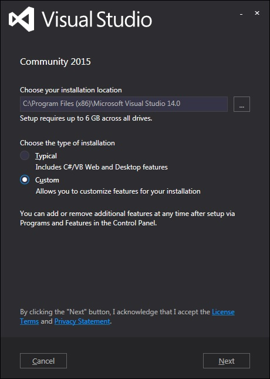
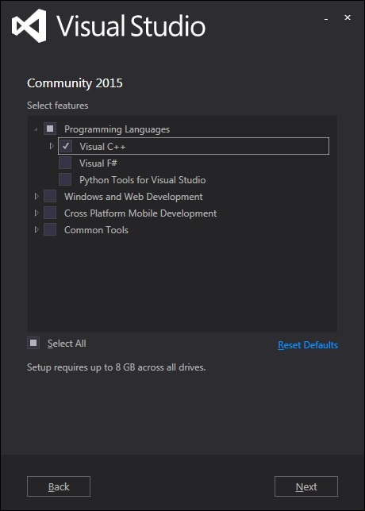
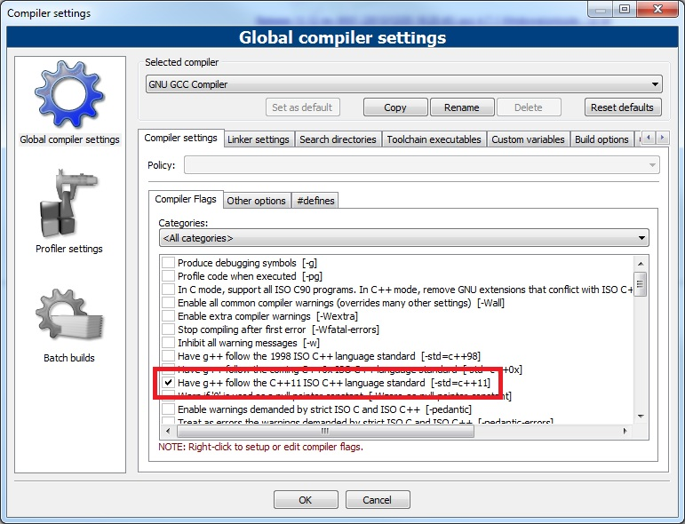

# Installing an integrated developemnt environment ide

As mentioned in the previous section, an Integrated Development Environment (IDE) contains all of the things you need to develop, compile, link, and debug your programs. So let’s install one.

The obvious question is, “which one?”. Keep in mind that you can install multiple IDEs, so there is no “wrong decision” here. During the course of these tutorials, we will be showing you some of the nice features of your IDE, such as how to do integrated debugging. All of our examples will be done using both Microsoft’s Visual C++ (for Windows), and Code::Blocks (for Linux or Windows). Thus we highly recommend you pick one of these.

However, if you would like to try a different IDE, you are free to do so. The concepts we show you will work for any IDE -- however, different IDE’s use different keymappings and different setups, and you may have to do a bit of searching to find the equivalent of what we show you.

## Windows IDEs

If you are developing on a Windows machine (as most of you are), then you have two choices:

1) If disk space and/or download size are not a constraint, then we recommend Visual Studio Community 2015. When installing this version, you’ll need to do a Custom installation and choose “Programming Languages -> Visual C++”, as the C++ compiler is not installed by default. You can also uncheck the “Windows and Web Development” checkbox.

2) If disk space and/or download size are a challenge, then we recommend Microsoft’s free [Visual Studio Express 2013 for Windows Desktop](https://www.microsoft.com/en-us/download/details.aspx?id=44914). When asked, choose “wdexpress_full.exe” and run it.

The installer that you download off of Microsoft’s web page is actually a downloader. When you run it, it will download the actual IDE from Microsoft and install it.

Note: This tutorial was originally written when Microsoft was distributing the 2005 version of Visual C++. Consequently, most references and screenshots are targeted to that version. Running any later versions (such as 2008, 2010, 2013, 2015, etc…) are fine, however, your screens may look slightly different.

## Linux or Windows IDEs

If you are developing on Linux (or you are developing on Windows but want to write programs that you can easily port to Linux), we recommend Code::Blocks. Code::Blocks is a free, open source, cross-platform IDE that will run on both Linux and Windows.

Windows users, make sure to get the version with MinGW bundled.

With Code::Blocks, C++11 functionality may be disabled by default. You’ll definitely want to check and turn it on. First, go to Settings->Compiler:

Then check the box marked “Have g++ follow the C++11 ISO C++ language standard [-std=c++11]:

Alternately, some people prefer to use Bloodshed’s Dev-C++, which also runs on both Windows and Linux.

## Mac OSX IDEs

Mac users can use [Xcode](https://developer.apple.com/xcode/) if it is available to you, or [Eclipse](http://www.eclipse.org/). Eclipse is not set up to use C++ by default, and you will need to install the optional C++ components.

## Can I use a web-based compiler?

Yes, for some things. While your IDE is downloading (or if you’re not sure you want to commit to installing one yet), you can continue this tutorial using a web-based compiler, such as the one at [CodeChef](CodeChef). Make sure you switch the compiler to “C++14 (G++ 4.9.2)”.

Web-based compilers are fine for dabbling and simple exercises. However, they are generally quite limited in functionality -- many won’t allow you to save projects, create executables, or effectively debug your programs. You’ll want to migrate to a full IDE when you can.

## Moving on

Once your IDE is installed (which is one of the hardest things this tutorial will ask you to do), or if you’re temporarily proceeding with a web-based compiler, you are ready to write your first
